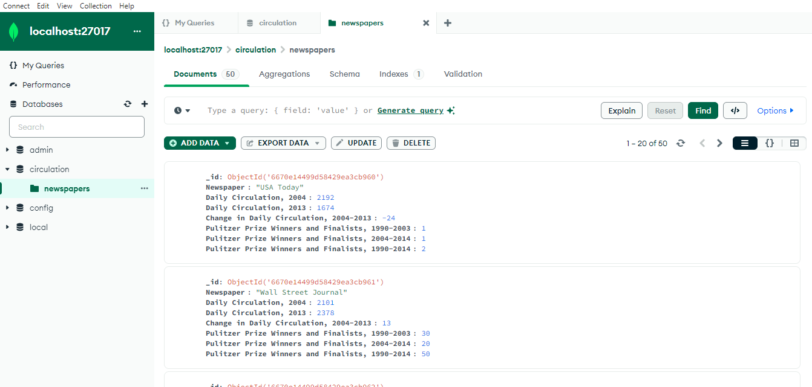

The result of `node app.js`

## MongoDB with Node.js 

> [!NOTE]
> This is a project made with a course by Pluralsight Author Jonathan Mills.
> 
> To run the project, it's necessary setting up MongoDB on your operational system. - [Install MongoDB](https://www.mongodb.com/docs/manual/installation/)

Then, install the npm dependencies
```bash
npm i
```
and then run
```bash
node app.js
```
on the project root folder.

## CRUD

CRUD is the acronym for CREATE, READ, UPDATE and DELETE. The goal of the project was to learn how to implement CRUD operations using a repository object.

All the operations executed are present on circulationRepo.js and asserted on app.js code. Some of the most important classes to understand are [MongoClient](https://mongodb.github.io/node-mongodb-native/6.7/classes/MongoClient.html), [db](https://mongodb.github.io/node-mongodb-native/6.7/classes/Db.html) (database), [collection](https://mongodb.github.io/node-mongodb-native/6.7/classes/Collection.html), [objectId](https://mongodb.github.io/node-mongodb-native/6.7/classes/BSON.ObjectId.html). The following operations were the goals for the project:
- Load Data (Create)
- Get (Read)
- GetById (Read)
- Add Item (Create)
- Remove Item (Delete)
- Update (Update)

Also there were aggregation operations - [pipelines](https://www.mongodb.com/docs/manual/core/aggregation-pipeline/) which consists of one or more stages that process documents
- Average Finalists
- Average Finalists by Circulation change
These can the most demanding operations to understand, because there are many aggregate stages - [reference](https://www.mongodb.com/docs/manual/reference/operator/aggregation-pipeline/).

## MongoDB Compass

With Compass, which is a tool for querying, optimizing, and analyzing MongoDB data, it can be easier to vizualise some of the sucessfull operations which are done in app.js
In this project code, you just need to comment the DB dropDatabase function on line 82 of the app.js



